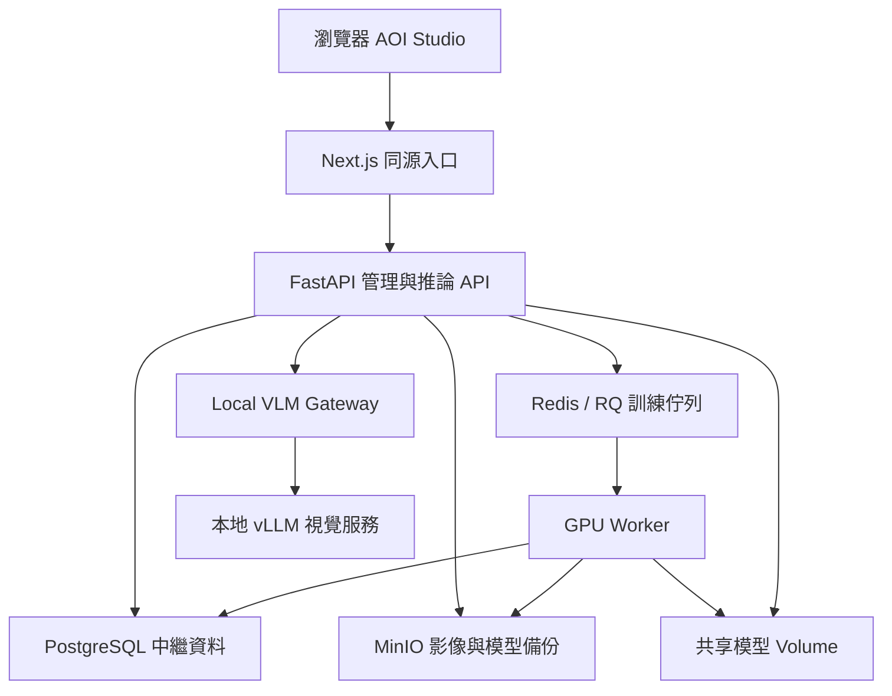
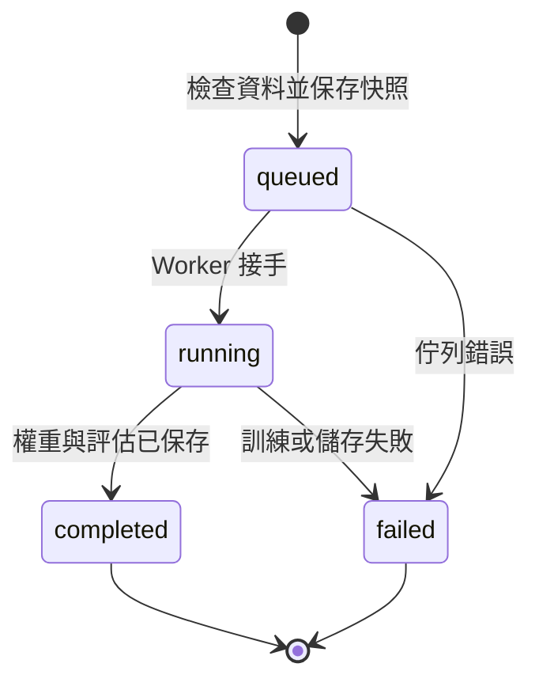
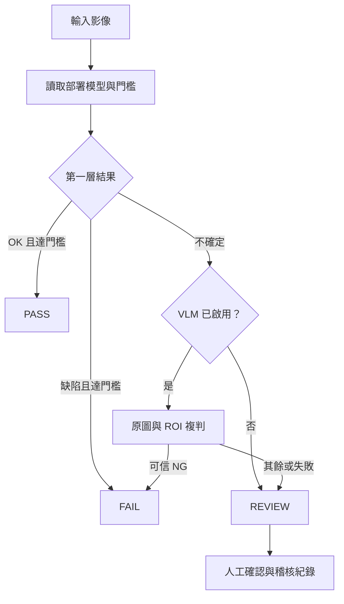

# 系統架構與工程設計

## 運行架構

Next.js standalone 對 `/api/*` 反向代理至 FastAPI，避免跨來源憑證設定。只有前端發佈主機 port，DB、Redis、MinIO、API 不公開 port。Docker internal network 隔離公網出口；預先配置的 VLM 服务加入同網路。

## 訓練生命週期

`jobs.train_job` 讀取快照與 MinIO bytes → Adapter.train → 保留集 evaluate → 寫本地權重、manifest 與 MinIO 備份 → Model record → Job completed。只有所有步驟完成才生成模型版本。

每個 worker 一次一份訓練。v0.1 使用 RQ 預設故障處理；worker 被強制終止時，應由維運人員檢查 RQ 狀態，尚無完整的工作中斷恢復控制台。

## 推論與複判

API 默認不讓 VLM 的 OK 自動 PASS。管理 API 的 `vlm_can_pass` 是明確政策開關，UI 不開放以避免誤用。正式產線仍需校準漏檢／誤判門檻與安全互鎖。

## Model Adapter

`load(path) / train(split,path,params,progress) / predict(raw) / evaluate(items) / export(path,format)`。

| Adapter | 輸入處理 | 訓練 | 原生檔 | 匯出 |
|---|---|---|---|---|
| baseline | RGB 24×24 / 255 | Logistic Regression，流程基準 | baseline.npz，禁用 pickle | native |
| cnn | RGB 48×48 / 255、CHW | 兩層 Conv，brightness augmentation，驗證 loss 挑最佳權重 | cnn.pt、labels.json | native / ONNX |
| yolo | Ultralytics 640 輸入 pipeline | 本地初始權重、YOLO data.yaml | best.pt | native / ONNX / TensorRT engine（需目標環境） |

CNN ONNX 輸入為 float32 `[1,3,48,48]`、0–1 RGB；輸出 logits，應 softmax 後依 labels.json 對應。YOLO 匯出前後處理依 Ultralytics 模型契約。TensorRT engine 與 GPU／CUDA／TensorRT 版本相關，不是通用跨設備檔。

Runtime v0.1 每次請求載入模型，降低版本快取不一致風險，但有冷啟動成本。量產版應做按 model_id 常駐載入、併發限制與原子切版，不能把目前 HTTP 耗時當作純 GPU kernel 延遲。

## 中繼資料與快照

目前以 SQLAlchemy `records` 表保存 `id`, `kind`, `project_id`, JSON `data`，kind/project_id 有索引。這是簡化的 MVP 實體存放方式，並非完整正規化產線 schema。

| 邏輯實體 | 重要欄位 |
|---|---|
| User | username、scrypt password hash、token_version、登入失敗計數 |
| Project | owner、task、labels、active_deployment |
| Image | object key、width/height、sha256、group、label、boxes、reviewed |
| Training Job | adapter、parameters、snapshot、snapshot_hash、status、logs、progress |
| Model | job_id、path、metrics、counts、parameters、snapshot_hash |
| Deployment | model_id、threshold、vlm_enabled、vlm_can_pass |
| Inspection | model_id、deployment_id、result、primary、secondary、latency、image key、review |
| Audit | inspection_id、人工判定、note、user、timestamp |

影像 annotation 在 Image record 內；dataset 為專案當前影像集合，每份 Training Job 形成版本快照。後續應拆分 normalized tables、加外鍵、唯一鍵、DB migration、分頁、留存政策、不可變 audit store。現有 API 概覽會載入專案完整清單，因此不適合百萬筆履歷。

## 安全與運維設計

- 密碼以 scrypt、隨機 salt 雜湊。會話為 HMAC 簽章、8 小時效期、HttpOnly、SameSite=Strict，登出增加 token_version 撤銷現有 token。
- 專案、模型、影像與檢測結果都驗證 owner。帳號共用與專案授權尚未實作。
- 瀏覽器寫入檢查 Origin，API Bearer 客戶端不必帶 Origin。
- 上傳限制 20 MB／25 MP，重新解碼為 RGB PNG；檔名由 UUID 產生，不使用用戶提供路徑。
- 不接受使用者上傳 pickle 或 Python 模型；可執行權重只由管理員於受控 weights 目錄配置。
- VLM 端點由環境設定，DNS 必須解析為 private/loopback 且主機名列入 allowlist，禁止 redirect，HTTP 客戶端不繼承代理環境。網路層 internal network 是主要出口保護。
- 備份恢復要同步 DB、MinIO、models volume。不能只備份權重而丟失類別與前處理資訊。

## 網路相機／簡易量測擴充

Camera Gateway 由 API 以 token 呼叫，Gateway 連接相機 LAN；相機 URL 以 Fernet 加密存入 camera record。量測由 API 執行 OpenCV，measurement record 與 MinIO 保存設定／結果／原圖。此擴充的網路與校正邊界見 `CAMERAS-MEASUREMENT.md`。
